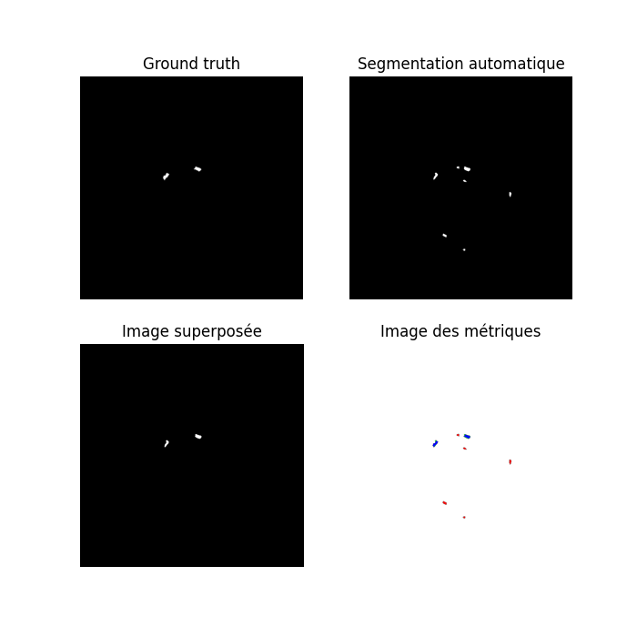

### Evaluation de méthodes de segmentation de stents biorésorbable en OCT.

L'évaluation des méthodes de segmentation de stents bi-résorbables en OCT (tomographie par cohérence optique) représente un domaine crucial dans le domaine médical. Les stents biorésorbables, en raison de leur nature temporaire, exigent une précision maximale lors de leur visualisation et de leur suivi. L'OCT, une technologie d'imagerie de haute résolution, offre une opportunité prometteuse pour évaluer ces stents. Ce projet vise à examiner et à évaluer différentes méthodes de segmentation, essentielles pour une interprétation précise des images OCT et pour la surveillance appropriée des stents biorésorbables. Cette introduction offre un aperçu de l'importance clinique et de la pertinence de cette étude, soulignant l'impact potentiel sur les pratiques médicales et la qualité des soins aux patients. et dans le but de notre projet est d'**évaluer les méthodes de segmentation automatique et manuelle de des stents en OCT** 

Dans le répertoire *Biores*, qui contient les données de six patients, chaque patient dispose de deux sous-dossiers, **J0** et **M6**. Chaque sous-dossier est identifié par un numéro différent, permettant de distinguer les images spécifiques à chaque patient pour l'OCT et la segmentation manuelle réalisée par les médecins. On se trouve également le dossier *mrcc* qui contient les résultats de la segmentation automatique obtenus à l'aide d'un réseau de neurones de type **mask-RCNN** développé par des étudiants. En parallèle, nous disposons d'une méthode de segmentation interactive décrite par Pierre-Yves Menguy dans sa thèse de 2016. L'objectif global de notre projet est de comparer les résultats de segmentation et d'analyser l'évolution du volume de polymère entre l'implantation du stent (J0) et le suivi à 6 mois (M6). Cette analyse se penchera sur la variation de volume pour chaque maille, chaque coupe et dans l'ensemble de la séquence.


## Les étapes de notre projet

- Etat d'art

Nous avons entamé notre projet par une revue de littérature approfondie, centrée sur la recherche et la synthèse des travaux antérieurs liés à notre domaine d'étude. Cette revue a englobé plusieurs aspects essentiels, notamment les différents types de stents existants, leurs applications cliniques variées, les techniques d'imagerie **OCT** et leur utilisation spécifique dans la visualisation des stents au sein des artères coronaires, ainsi que l'exploration des architectures de deep learning pour la segmentation automatique de ces stents.

- Calcul des **composantes connexes**

Le calcul des composantes connexes est une étape importante dans le traitement d'images pour la segmentation. Pour identifier et étiqueter différentes parties connectées dans une image. Dans notre cas, on a utilisé la Librairie Python `scikit-image` (abrégée en `skimage`) qui est une puissante bibliothèque dédiée au traitement d'images. Elle offre un large éventail de fonctionnalités pour la manipulation , le traitement et l'analyse d'images, y compris la segmentation et le calcul des composantes connexes.

```python
from skimage import io, measure
```

Pour calculer les comoposantes connexes dans une image en utilisant `scikit-image` on utilise la fonction `label` du module `measure` qui attribue des étiquettes aux différents régions connectées dans une image.

Pour entamer notre projet, nous avons mis en place un code Python utilisant la bibliothèque `scikit-image`. Ce code sélectionne une image de segmentation spécifique, puis procède au calcul du nombre de struts détectés dans cette image.

```python
# Charger l'image segmentée
image_segmentee = io.imread('struts_cartesian_20141029182218_240.png')

# Obtenir les labels (étiquettes) pour chaque région
labels, nombre_de_struts = measure.label(image_segmentee, connectivity=2, return_num=True)

# Calculer les propriétés de chaque région (strut)
regions = measure.regionprops(labels)
```

En utilisant les fonctionnalités de `scikit-image`, nous avons mis en place un processus initial pour identifier et compter les struts, constituants essentiels des stents, dans les images de segmentation. Ce travail préliminaire sert de fondation pour une analyse plus approfondie et une segmentation précise des composants des stents bi-résorbables dans les images OCT.

- Calcul des métriques

Par la suite après avoir labelliser les struts détectés dans la segmentation on passe à l'évalution de cette segmentation, le calcul des métriques. Dans un premier temps, on a essayé d'écrire un code qui effectue la comparaison entre deux images de segmentation; une image de segmentation automatique('**seg_auto**') et une image de référence de segmentation manuelle ('**seg_manuelle**'). L'objectif de notre code est d'évaluer la précision de la segmentation automatique par rapport à la référence manuelle en comptant les régions communes, les **vrais positifs** , les **faux positifs** et les **faux négatifs**.

Notre code se résume de la manière suivante:
1. *Chargement des images*: Les images de segmentation et manuelle sont chargées à l'aide de la bibliothèque (`scikit-image`).
2. *Redimensionnement*: On a ajusté la taille de l'image de segmentation manuelle qui est ajustée pour correpondre à celle de l'image de segmentation automatique. 
3. *Calcul des composantes connexes*: Les composantes connexes sont identifiées dans les deux images à l'aide la fonction `measure.label` de `scikit-image`.
4. *comparaison des composantes*: Les pixels des composantes connexes sont comparés entre les deux images pour déterminer les **vrais positifs**, les **faux positifs** et les **fauw négatifs**.
5. *Création d'images pour l'évaluation*: Des images sont crées pour visualiser les régio communes, les vrais positifs, les faux positifs entre les deux segmentations.
6. *Affichage des résultats*: Les résultats de l'évaluation (nombre total de struts détectés, nombre de vrais positifs, faux positifs et faux négatifs) sont affichés dans la console. De plus, quatre sous-graphiques sont affichés dans une figure, montrant respctivement: l'image de référence; l'image de segmentation automatique, une superposition des régions communes, et une image colorée représentant les résultats de l'évaluation.

Le but de cette étape est de faire un code qui permet l'analyse visuelle et quantitative de la précision de la segmentation automatique par rapport à la segmentation manuelle des struts, en mattent en évidence les régions de concordance et les divergence entre les deux méthodes de segmentation.

 

- Automatisation du code
  
Le but principal de cette étape est d'automatiser la classification des images de segmentation automatique des 6 patients en deux dossiers distincts : *Patient_X_J0* et *Patient_X_M6*, où *X* représente le numéro de chaque patient. Ces dossiers contiendront les images correspondant à chaque patient aux moments J0 et M6 respectivement, organisées selon des identifiants spécifiques à chaque patient pour les deux temps.

```
patient 1: 20141029182218 "J0" / 20150429114648 "M6"
patient 2: 20141124130653 "J0" / 20150513104518 "M6"
patient 3: 20141126124321 "J0" / 20150511103534 "M6"
patient 4: 20141217150502 "J0" / 20150810114215 "M6"
patient 5: 20150619093736 "J0" / 20151103152109 "M6"
patient 6: 20150114125448 "J0" / 20150603113535 "M6"

```
Et donc après donner au code le chemin des dossiers crées, et les identifiants de chaque patient au moment J0 et au moment M6 et implémente la fonction suivante:

```python
def copier_images_du_patient(source_folder, identifiant_Patient, dossier_patient):
    for dossier, _, fichiers in os.walk(source_folder):
        for fichier in fichiers:
            if fichier.startswith(identifiant_jour):
                chemin_source = os.path.join(dossier, fichier)
                shutil.copy(chemin_source, dossier_patient)
```
Notre fonction `copier_images_du_patient` prend en paramètre le `source_folder` qui correpond au chemin du dossier source ou se trouve les images à copier  , `identifiant_Patient` qui correpond au identifiantn unique du patient pour lequel nou svoulons copier les images et  `dossier_patient` qui correspond au chemin du dossier du destination ou les images du patient seront copiées. Le but de notre fonction est de copier les images correspondant à un patient spécifique depuis le dossier source vers le dossier patient destinataire. Ona utilisé `os.walk` pour parcourir le doussier source et copier les fichiers correspondant à l'identifiant spécifié du patient.

Ensuite, pour chaque patient et pour chaque temps (J0 et M6), la fonction `copier_images_du_patient` est appelée avec les chemins appropriés du dossier source et destinaities ainsi que les identifiants spécifiques du patient pour copier les images dans les dossiers correspondants.

```python
# Copie pour le dossier Patient 1 J0
copier_images_du_patient(dossier_train, identifiant_Patient_1_J0, dossier_patient_1_J0)
copier_images_du_patient(dossier_test, identifiant_Patient_1_J0, dossier_patient_1_J0)
```
Chaque section de copie est duppliquée pour les dossiers `dossier_train` et `dossier_test`, ce qui suggère que les images à séparer sont présentes dans ces deux dossiers.

Après avoir organisé les dossiers de manière distincte, nous avons automatisé la troisième étape du processus en vue de l'appliquer à l'ensemble des patients pour les dossiers J0 et M6. Cette automatisation vise à générer des fichiers textes ainsi que quatre sous-graphiques pour chaque patient dans les dossiers respectifs J0 et M6. En utilsant la fonctio suivante:

```python
def patient_segmentation(num_patient, dossier_manuelle, dossier_auto, dossier_graphes, fichier_resultats, debut, fin, identifiant_struts_manuelle, identifiant_struts_auto)
```
Cette fonction prend en paramètre l'identifiant du patient, les chemins vers les images de la segmentation manuelle et automatiques, le repétoires pour sauvgarder les graphiques, le fichier pour stocker les résultats, ainsi que des paramètres pour déterminer les coupes à traiter et les identifiants pour les images.

```python
patient_segmentation(
    num_patient="1",
    dossier_manuelle=r'C:\Master Techmed 2\TP synthèse\Biores\1\M6',
    dossier_auto=r'C:\Master Techmed 2\TP synthèse\mrcnn\mrcnn\Patient1M6',
    dossier_graphes=r'C:\Master Techmed 2\TP synthèse\result\GraphesM6patient1',
    fichier_resultats=r'C:\Master Techmed 2\TP synthèse\result\resultatsM6patient1.txt',
    debut=218,
    fin=372,
    identifiant_struts_manuelle="Struts_20150429114648",
    identifiant_struts_auto="struts_cartesian_20150429114648"
)
```
En utilisant ces paramètres, cette fonction charge les images, effectue la segmentation, crée des graphiques détaillé, et enregistre les résultats dans un fichier texte dédié. En modifiant les valeurs de ces paramètres et en appelant cette fonction avec différentes configurations, il est possible de d'automatiser le processus pour les 6 patients et différentes étapes temporelles.

### Calcul du dice par échelle de strut
Dans la seconde phase de notre étude, nous nous sommes concentrés sur l'évaluation du volume du polymère utilisé dans les stents biorésorbables. Notre objectif principal était de comparer les mesures prises au début de l'étude (**J0**) avec celles effectuées six mois après l'implantation (**M6**).

Il est crucial de souligner que les stents biorésorbables sont fabriqués à partir d'un polymère spécifique qui possède une caractéristique unique : il se dégrade progressivement dans le corps au fil du temps. Cette propriété intrinsèque est fondamentale pour comprendre les résultats de notre étude, car elle influence directement le volume du polymère mesuré à différents moments. En observant les changements de volume entre **J0** et **M6**, nous pourrons mieux appréhender la dynamique de résorption du polymère et son impact sur l'efficacité et la sécurité des stents biorésorbables dans le traitement des patients.

La figure ci-dessous met en évidence cette caractéristique en comparant deux types de stents utilisés en cardiologie : le stent *biorésorbable* situé en haut de l'image et le stent *actif* en bas. Les intervalles de temps sont indiqués en bas de chaque image pour faciliter la comparaison entre les deux types de stents.


